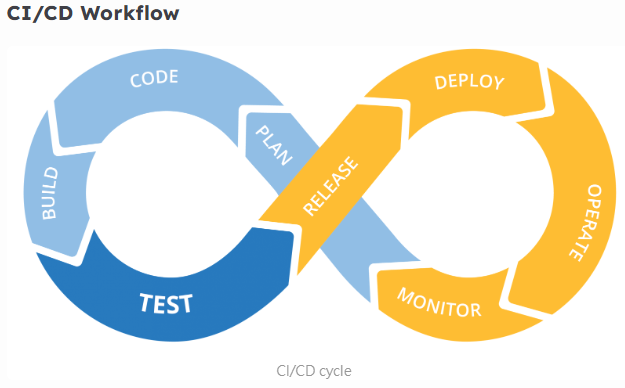
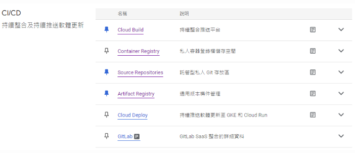
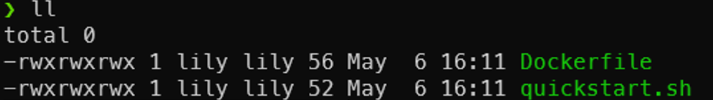
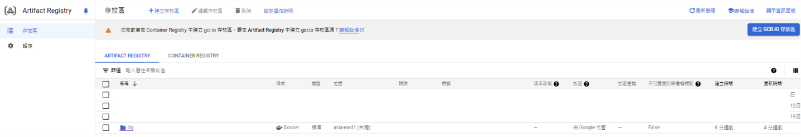
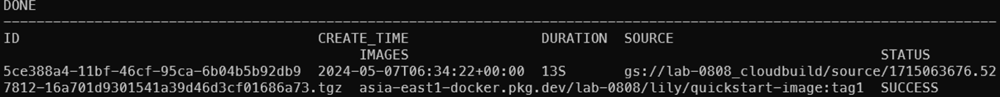
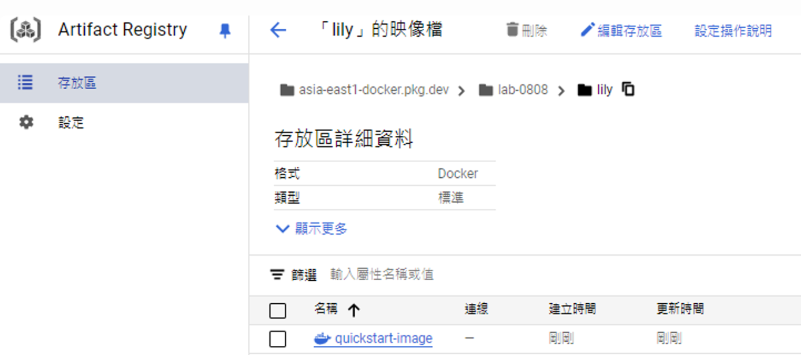
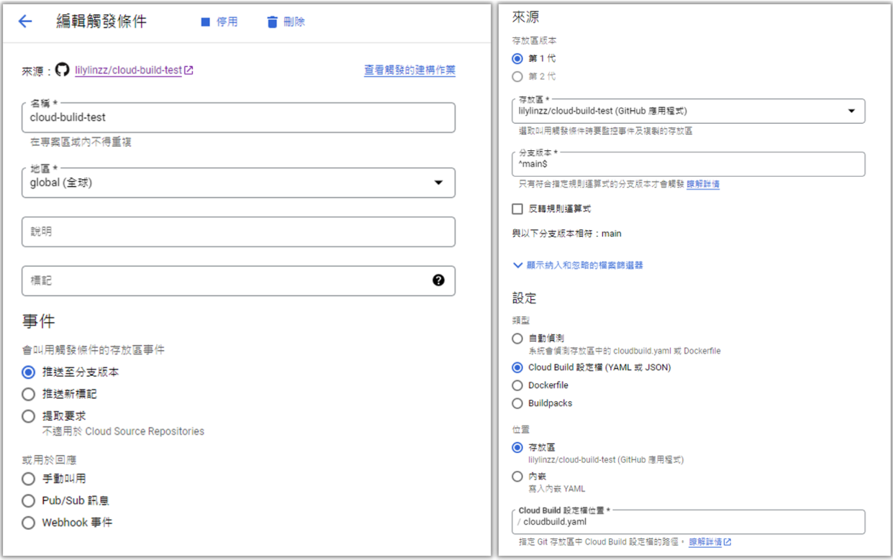
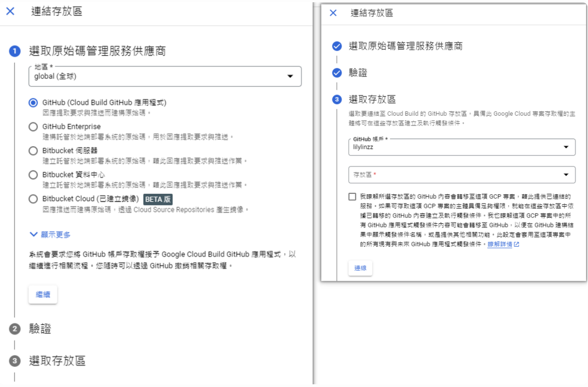
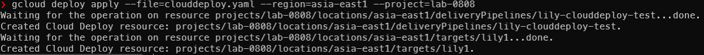
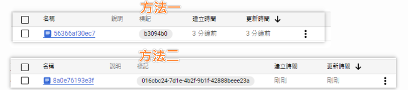

### CI/CD Workflow

CI 持續整合
(1)專案程式碼提交 (commit → push / merge)
(2)Build、單元測試、整合測試、程式碼規範檢查
CD 持續交付
(3)完成程式碼部署、營運、監控

<!--more-->


---

### 優點
避免版本衝突
降低人為操作失誤
減少人工時間花費
及早發現(bug)及早修正(fix)
專注開發提高生產力
加速產品迭代

---

## GCP CI/CD



### Cloud Build
 是一項在 Google Cloud 基礎架構上執行建置的服務。
 可從 Cloud Storage、Cloud Source Repositories、GitLab、GitHub 或 Bitbucket 匯入原始程式碼。
根據您的規範執行構建，並產生 Docker 容器或 Java 存檔等工件。

### Artifact Registry
用於管理私有套件和 Docker 容器映像的存放區

### Container Registry 容器註冊表
2024/5/15後，已棄用，新專案無法再推送
2025/3/18後，將關閉

### Cloud Deploy
可依照定義的升級順序自動將應用程式交付到一系列目標環境。
達到持續交付。

### Source Repositories
託管在 Google Cloud 的 Git儲存庫

---

## Cloud Build 

### 實作-1
這邊會使用 Cloud Build 構建 Docker image 並將 image 推送到 GAR。

#### 首先新增以下兩個檔案
1.quickstart.sh

```shell=
#!/bin/sh
echo "Hello, world! The time is $(date)."
```

2.Dockerfile
```yaml=
FROM alpine
COPY quickstart.sh /
CMD ["/quickstart.sh"]
```



#### 在 GCP Artifact Registry 建立存放區



#### 執行CloudBuild
有兩種方式1.直接透過指令執行、2.透過cloudbuild.yaml檔案執行
這邊使用第2種，所以需建立cloudbuild.yaml
```yaml=
steps:
- name: 'gcr.io/cloud-builders/docker'
  script: |
    docker build -t asia-east1-docker.pkg.dev/lab-0808/lily/quickstart-image:tag1 .
  automapSubstitutions: true
images:
- 'asia-east1-docker.pkg.dev/lab-0808/lily/quickstart-image:tag1'
```

#### 開始創建 docker image
```shell=
gcloud builds submit --region=asia-east1 --config cloudbuild.yaml
```

#### 成功訊息




---

### 實作-2
使用觸發條件連結 github 自動 CI

#### 環境準備
github建立新的repo，git clone到本地端，放入自己的專案
並建立Dockerfile、cloudbuild.yaml 兩份檔案

Dockerfile
```dockerfile=
FROM nginx
COPY . /usr/share/nginx/html
```
cloudbuild.yaml
```yaml=
steps:
- name: 'gcr.io/cloud-builders/docker'
  script: |
    docker build -t asia-east1-docker.pkg.dev/peaceful-branch-395402/test1/lilybuild:tag1 .
  automapSubstitutions: true
images:
- 'asia-east1-docker.pkg.dev/peaceful-branch-395402/test1/lilybuild:tag1'
```


#### CloudBuild 設定觸發條件、連結存放區






#### 推送版本到指定的 github 存放區，觸發 CloudBuild
紀錄 > 版本紀錄可查看是哪條觸發名稱推送版本


#### 成功建置 image 到 GAR
GAR > 存放區 檢查image有成功推上去

---

## Cloud Deploy 
將應用程式部署至GKE


### 準備 skaffold.yaml、k8s-pod.yaml、clouddeploy.yaml

skaffold.yaml
```yaml=
apiVersion: skaffold/v4beta7
kind: Config
manifests:
  rawYaml:
  - k8s-*
deploy:
  kubectl: {}
```

k8s-pod.yaml
```yaml=
apiVersion: v1
kind: Pod
metadata:
  name: lily-clouddeploy-test
spec:
  nodeSelector:
        cloud.google.com/gke-nodepool: lily1
  containers:
  - name: nginx
    image: my-app-image
```

clouddeploy.yaml
```yaml=
apiVersion: deploy.cloud.google.com/v1
kind: DeliveryPipeline
metadata:
  name: lily-clouddeploy-test
description: main application pipeline
serialPipeline:
  stages:
  - targetId: lily1
    profiles: []

---

apiVersion: deploy.cloud.google.com/v1
kind: Target
metadata:
  name: lily1
description: development cluster
gke:
  cluster: projects/lab-0808/locations/asia-east1-a/clusters/lab-gke
```


### 使用 Cloud Deploy 服務註冊管道與目標

指令
```shell=
gcloud deploy apply --file=clouddeploy.yaml --region=asia-east1 --project=lab-0808
```
成功訊息



### 建立版本

指令
```
gcloud deploy releases create release-lily1-2 \
  --project=lab-0808 \
  --region=asia-east1 \
  --delivery-pipeline=lily-clouddeploy-test \
  --images=my-app-image=gasia-east1-docker.pkg.dev/lab-0808/lily-test/quickstart-image:tag1
```


---

## 補充:
### Q1. 
#### h4觸發條件連接Google Source Repositories

A. 先在Source Repositories建立存放區，再建立觸發條件時，存放區版本第1代中可直接選擇Cloud Source Repositories，不用連結新的存放區


### Q2.
#### Cloud Build 自動帶版號

A. 
方法一、cloudbuild.yaml 使用環境變量 $SHORT_SHA'
使用 git 提交的前7個字符作為版本號
```
steps:
- name: 'gcr.io/cloud-builders/docker'
  args: [
    'build',
    '-t',
    'asia-east1-docker.pkg.dev/lab-0808/lily-test/quickstart-image:$SHORT_SHA',
    '.',
  ]
images:
  - 'asia-east1-docker.pkg.dev/lab-0808/lily-test/quickstart-image:$SHORT_SHA'
```

方法二、cloudbuild.yaml 使用環境變量 $BUILD_ID'
使用每次構建的唯一標示符來生成版號


方法三、自動遞增版本號


### Q3. 
#### 目標環境同一個 GKE Cluster

A.使用 skaffold.yaml 設定變數可以區分環境
( 待補充設定方式 )


---

### 參考文件
Cloud Build
https://cloud.google.com/build/docs/build-push-docker-image
Cloud Deploy
https://cloud.google.com/deploy/docs/overview
build trigger
https://cloud.google.com/build/docs/automating-builds/create-manage-triggers#build_trigger
Build and Deploy apps with CI/CD
https://cloud.google.com/build/docs


