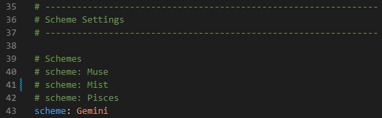

## Step.1 建立新儲存庫

- 儲存庫名稱命名為 `username.github.io` username 需為 Github 使用者名稱，後續才可以直接用此名稱開啟頁面 (下圖示範因已建立過相同檔名所以有紅字，正常要是綠色勾勾)
- 勾選 public 公開


---

## Step.2 在本地端安裝Hexo (wsl2)

- 安裝 npm <[NPM 套件管理工具](https://github.com/nodejs-tw/nodejs-wiki-book/blob/master/zh-tw/node_npm.rst?source=post_page-----4d295ed96236---------------------------------------)>
    
    ```bash
    sudo apt-get install python-software-properties
    sudo add-apt-repository ppa:gias-kay-lee/npm
    sudo apt-get update
    sudo apt-get install npm
    npm -v
    ```
    

- 安裝 hexo (在vscode操作會比較方便)
    
    ```bash
    sudo npm install hexo-cli -g
    hexo init <username>.github.io #跟剛剛建的倉庫同名字，會建出很多檔案
    cd <username>.github.io
    npm install
    ```

- 推上 github 倉庫

    ```bash
    cd <username>.github.io
    git init
    git add .
    git commit -m init
    git remote add origin git@github.com:<your_repo>/<username>.github.io.git
    git branch -M main
    git push -u origin main
    ```
 

---    

## Step.3 了解 Hexo 基本結構 & 操作指令

- 結構
    
    > node_module -> 這個專案所需要的Package (剛剛透過npm install所安裝)
    public -> 存放網頁中的文章、圖片、標籤等資料。
    scaffolds -> 存放網站的內容模板。
    themes -> 存放網站的主題 (稍後介紹)
    _config.yml -> 主要設定網站內容的檔案
    > 

- 操作
    
    > hexo clean  -> 將目前資料夾中的所有靜態網頁清除
    hexo generate  -> 按照當前設定檔，產生對應靜態網頁
    hexo server  -> 在本地端產生網頁 localhost:4000
    hexo deploy  -> 部署到 GitHub
    
- _config.yml 是 Hexo 的主要設定檔，在此調整標題、作者、描述...等等的設定


---

## Step.4 部署靜態頁面到分支

- 修改 `_config.yml` 中的 deploy 內容 ( 這邊指定新的分支 gh-pages，待會deploy時會在遠端自動建立 )
    
    ```yaml
    deploy:
      type: git
      repo: git@github.com:lilylinzz/lilylinzz.github.io.git
      # example, https://github.com/hexojs/hexojs.github.io
      branch: gh-pages
    ```
    
- 之後若有修改網頁內容，hexo server 本地測試沒問題即可 hexo deploy 將靜態頁佈署到 gh-pages 分支
    
    ```bash
    hexo clean
    hexo generate
    hexo server     # localhost:4000 本地測試，沒問題即可部署
    hexo deploy     #只會將靜態網頁部署到分支
    ```
    
- 到 github_page 頁面選擇分支 → save


- https://[username].github.io 即可看到自己的網站
    

---

## Step.5 選擇主題

- [Hexo Theme](https://hexo.io/themes/?source=post_page) 提供多種主題可選擇，各自有安裝教學，本篇選擇的是簡約但功能強大的主題: [NexT](https://theme-next.js.org/)


---

## Step.6 安裝主題 NexT

- 可直接透過 npm 安裝
    
    ```bash
    npm install hexo-theme-next
    ```
    
- 設定檔 `~/_config.yml` 中找到 theme，更改為 next
    
    ```bash
    theme: next
    ```
    
- 一般主題設定檔配置於 `themes/next/_config.yml` 或 `node_modules/hexo-theme-next/_config.yml(透過npm安裝會在這裡)` ，而 NexT 鼓勵用戶使用備用主題配置。
於根目錄手動創建設定檔 `_config.next.yml` ，將所需的 NexT 主題選項從預設主題設定檔複製到此設定檔中。
    
    ```bash
    cp node_modules/hexo-theme-next/_config.yml _config.next.yml
    ```

- NexT 提供四種樣式供選擇 Muse、Mist、Pisces、Gemini，將自己喜歡的取消註解


    
- 測試就會看到網站樣貌已改變
    ```
    hexo clean
    hexo generate
    hexo server
    ```

---

相關文章
* [Hexo-NexT 增加側欄功能](https://lilylinzz.github.io/2025/03/12/hexo-sidebar/)
* [Hexo-NexT 版面調整](https://lilylinzz.github.io/2025/03/12/windows-terminal/)