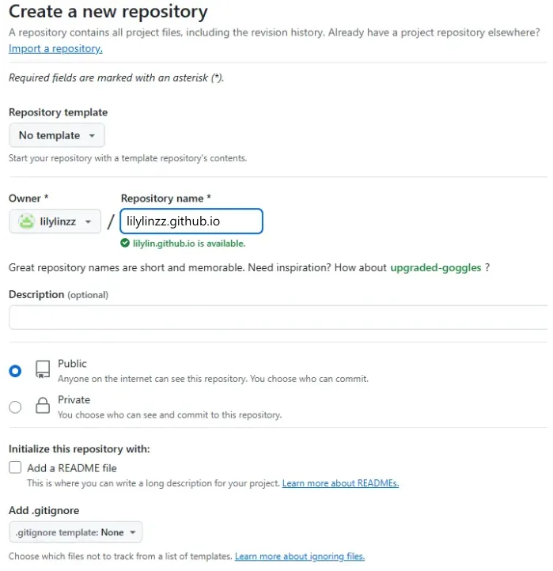
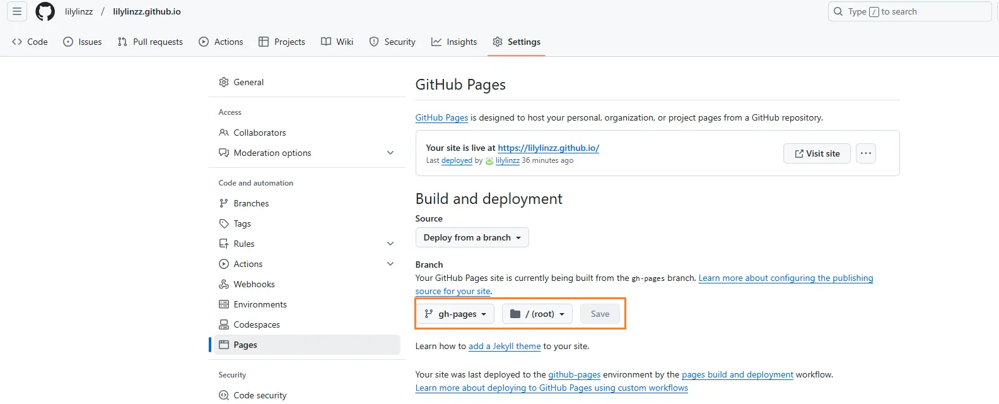

# Step.1 建立新儲存庫

- 儲存庫名稱命名為 `username.github.io` username 需為 Github 使用者名稱，後續才可以直接用此名稱開啟頁面 (下圖示範因已建立過相同檔名所以有紅字，正常要是綠色勾勾)
- 勾選 public 公開




---

# Step.2 在本地端安裝Hexo (wsl2)

- 安裝 npm <[NPM 套件管理工具](https://github.com/nodejs-tw/nodejs-wiki-book/blob/master/zh-tw/node_npm.rst?source=post_page-----4d295ed96236---------------------------------------)>
    
    ```bash
    sudo apt-get install python-software-properties
    sudo add-apt-repository ppa:gias-kay-lee/npm
    sudo apt-get update
    sudo apt-get install npm
    npm -v
    ```
    

- 安裝 hexo (在vscode操作會比較方便)
    
    ```bash
    sudo npm install hexo-cli -g
    hexo init <username>.github.io #跟剛剛建的倉庫同名字，會建出很多檔案
    cd <username>.github.io
    npm install
    ```

- 推上 github 倉庫

    ```bash
    cd <username>.github.io
    git init
    git add .
    git commit -m init
    git remote add origin git@github.com:<your_repo>/<username>.github.io.git
    git branch -M main
    git push -u origin main
    ```
 

---    

# Step.3 了解 Hexo 基本結構 & 操作指令

- 結構
    
    > node_module -> 這個專案所需要的Package (剛剛透過npm install所安裝)
    public -> 存放網頁中的文章、圖片、標籤等資料。
    scaffolds -> 存放網站的內容模板。
    themes -> 存放網站的主題 (稍後介紹)
    _config.yml -> 主要設定網站內容的檔案
    > 

- 操作
    
    > hexo clean  -> 將目前資料夾中的所有靜態網頁清除
    hexo generate  -> 按照當前設定檔，產生對應靜態網頁
    hexo server  -> 在本地端產生網頁 localhost:4000
    hexo deploy  -> 部署到 GitHub
    > 


---

# Step.4 部署靜態頁面到分支

- 修改 `_config.yml` 中的 deploy 內容 ( 這邊指定新的分支 gh-pages，待會deploy時會在遠端自動建立 )
    
    ```yaml
    deploy:
      type: git
      repo: git@github.com:lilylinzz/lilylinzz.github.io.git
      # example, https://github.com/hexojs/hexojs.github.io
      branch: gh-pages
    ```
    
- 之後若有修改網頁內容，皆測試後部署到分支
    
    ```bash
    hexo clean
    hexo generate
    hexo server     # localhost:4000 本地測試，沒問題即可部署
    hexo deploy     #只會將靜態網頁部署到分支
    ```
    
- 到 github_page 頁面選擇分支 → save




- https://<username>.github.io 即可看到自己的網站
    
    
    ---
    其他
    
    * _config.yml 調整標題、描述、作者...等等

    * 也可另外選主題更換 (各別主題有安裝教學)
    https://hexo.io/themes/?source=post_page