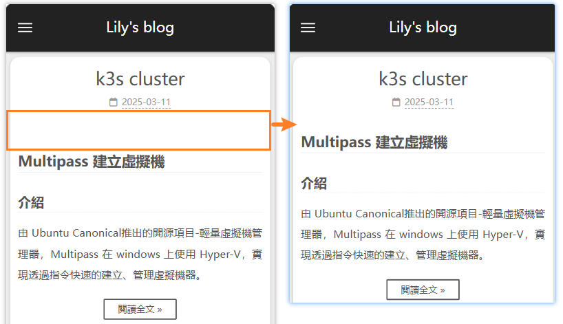

## 圓角

`~/source/_data/variables.styl` 此檔案中加入設定 (沒有檔案就自己新增)

```bash
// 圆角设置
$border-radius-inner     = 15px; #數字越大圓角弧度越大
$border-radius           = 15px;

//側邊欄位頂部黑色背景，設置上方圓角
.site-brand-container{
    border-radius: 15px 15px 0px 0px; #順序: 左上 右上 左下 右下
}
```

---

### 調整文章標題與內文之的寬度

標題下的 margin-bottom 為 60px，導致在行動裝置上看起來間距太大，調整為 25px。

`~/source/_data/variables.styl` 添加設定
```
//調整文章標題與內文縮排
.post-header.animated.fadeInDown {
  margin-bottom: 25px;
}
```
呈現


---