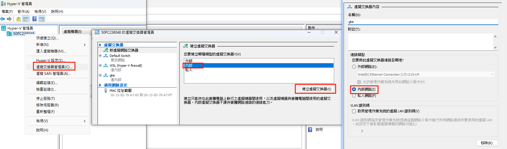
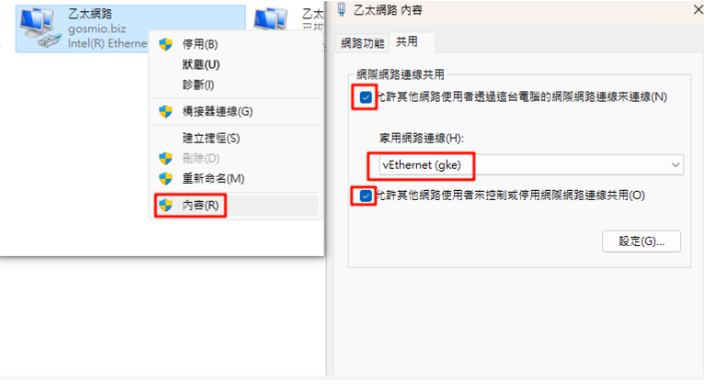
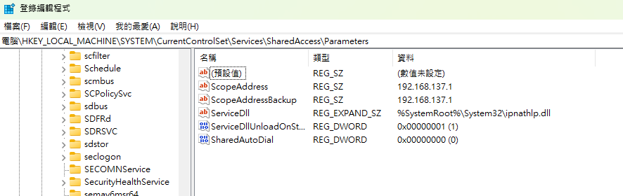

## Multipass 建立虛擬機

### 介紹
由 Ubuntu Canonical推出的開源項目-輕量虛擬機管理器，Multipass 在 windows 上使用 Hyper-V，實現透過指令快速的建立、管理虛擬機器。

<!--more-->

### 下載
[Multipass官網](https://canonical.com/multipass) 下載 windows 版 multipass

### 網路設定
1.於Hyper-V 右鍵建立 虛擬交換器管理員 ->  外部 -> 建立虛擬交換器 -> 名稱(k3s)


2.控制台 -> 網路和共用中心 -> 變更介面卡設定 -> 乙太網路右鍵內容 -> 開啟共用


3.設定 bridge
```
multipass set local.bridged-network=k3s
```

### 建立虛擬機器
1.建立3台虛擬機，做為 k3s node
```
multipass launch --name master --cpus 2 --memory 2g --disk 10g --bridged --network "name=k3s,mode=manual"
multipass launch --name node1 --cpus 2 --memory 2g --disk 10g --bridged --network "name=k3s,mode=manual"
multipass launch --name node2 --cpus 2 --memory 2g --disk 10g --bridged --network "name=k3s,mode=manual"
```

2.設定自訂IP
```
multipass exec 'master' -- sudo vi /etc/netplan/50-cloud-init.yaml
```
```
eth2:
    dhcp4: no
    addresses: [192.168.137.33/24]
    nameservers:
      addresses: [8.8.8.8]
    routes:
      - to: 0.0.0.0
        via: 192.168.137.1
```
註: 192.168.137.1 如要更換掉預設值需修改註冊檔


3.重啟master
```
multipass exec master -- sudo init 6
```
---

## 安裝 k3s

### Master Node
1.登入 master 並安裝 k3s
```
multipass shell master
```
```
export INSTALL_K3S_VERSION=v1.24.17+k3s1 && curl -sfL <https://get.k3s.io> | K3S_KUBECONFIG_MODE="644" INSTALL_K3S_EXEC=" --disable traefik" sh -
```

2.查看master節點token與IP-複製起來備用
```
sudo cat /var/lib/rancher/k3s/server/node-token
```
```
kubectl get node -owide
```

### Worker Nodes
1.登入 node1 安裝 k3s，並加入master
```
multipass shell node1
```
```
export INSTALL_K3S_VERSION=v1.24.17+k3s1 && curl -sfL <https://get.k3s.io> | K3S_URL=https://192.168.137.33:6443 K3S_TOKEN=[剛剛查的master token] sh -
```
2.登入 node2，重複上一步驟

3.回到 master 查看叢集狀態
```
kubectl get node
```

4.node1 與 node2 新增 label node
```
kubectl label node node1 node-role.kubernetes.io/node=""
kubectl label node node2 node-role.kubernetes.io/node=""
```

註: 刪除 label
```
kubectl label node node1 node-role.kubernetes.io/node-
```