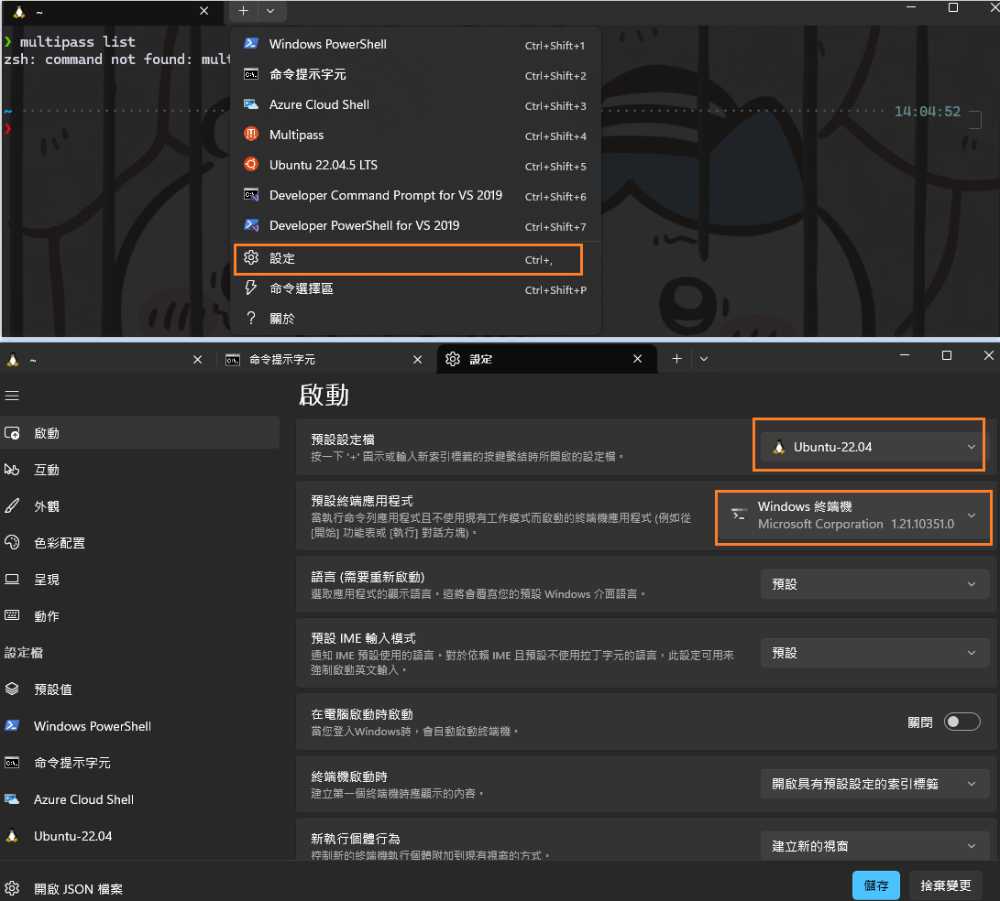
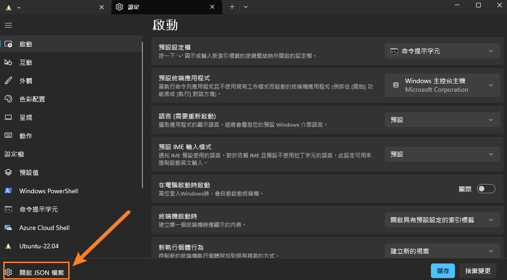
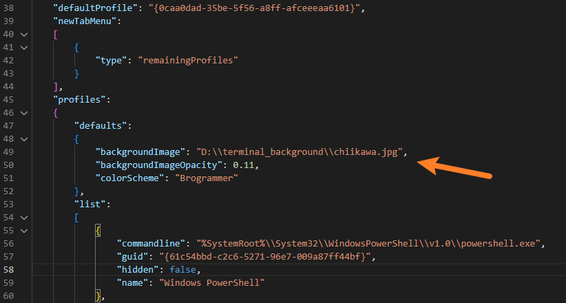

## 安裝 Windows Terminal
在 Microsoft Store 搜尋 Windows Terminal 下載安裝

---

## 更改預設啟動
開啟 Windows Terminal，下拉選單 > 設定
預設啟動 > 調整自己最常用的設定檔
預設終端應用程式 > 調整為 Windows 終端機


---

## 改背景

左下角開啟 setting.json


profiles > defaults 加入背景圖片與透明度設定
```
"backgroundImage": "D:\\terminal_background\\chiikawa.jpg",
"backgroundImageOpacity": 0.11,
```

